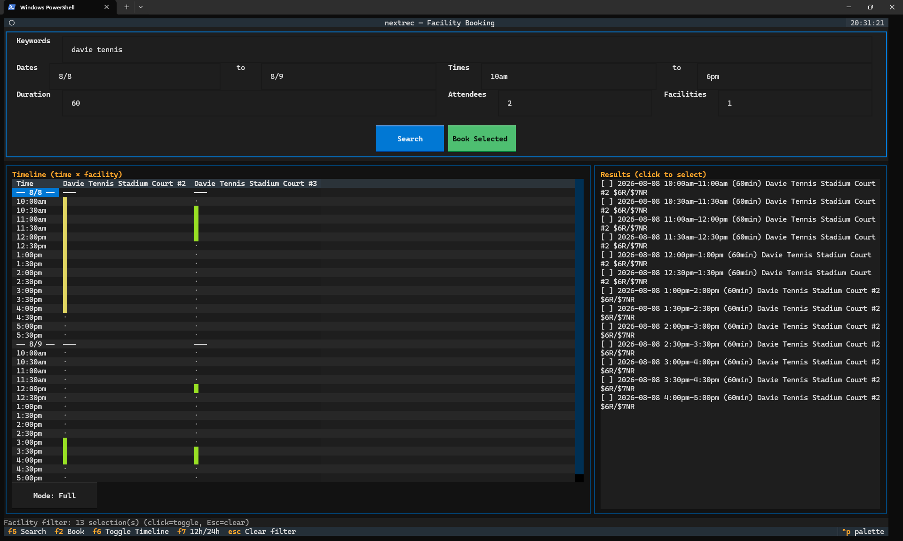

# nextrec

CLI to locate and book facility reservations on Oakland, CA's Parks and Rec site.



## Installation

```sh
git clone <repo>
cd nextrec
python -m venv .venv
.venv\Scripts\Activate.ps1   # or source .venv/bin/activate on Linux
pip install -e ".[dev]"
```

(Not yet published to PyPI — install from source as above.)

### Developer setup

Same as installation above.

## Quick Start

```sh
nextrec tui
```

Help available with:
```sh
nextrec --help
nextrec tui --help
```

## Commands

| Command | Description |
|---------|-------------|
| `book` | Search facilities and optionally book the first available slot |
| `auth` | Open headed browser for manual login and save session |
| `tui` | Interactive TUI for searching, filtering, selecting, and booking slots |
| `generate-config` | Generate a constraints config file for use with `book --config` |
| `debug-browse` | Open headed browser, interact freely, then analyze captured network traffic |

Use `nextrec <command> --help` for full option details.

