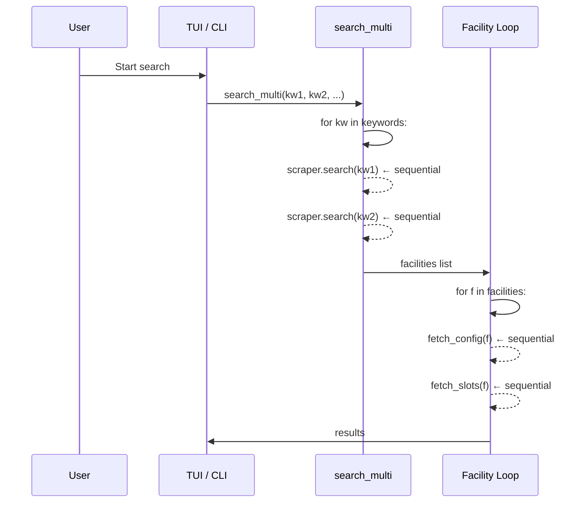
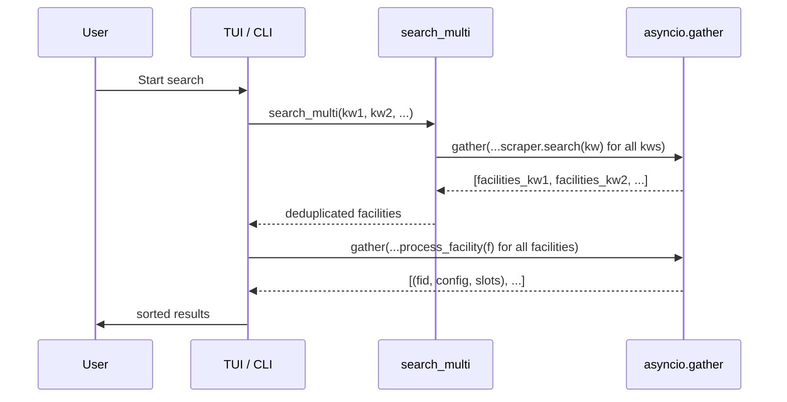

# Plan: Parallelize Searches and Facility Loading

## Status

Drafting

## Goal

Speed up searches by running keyword searches and facility config/slot fetches in parallel using `asyncio.gather`, with rate-limiting to avoid overwhelming the browser.

## Scope

- Parallelize keyword searches in `search_multi` (currently sequential loop)
- Parallelize per-facility config + slot fetching in both TUI and CLI
- Fix the `_get_scraper` coroutine bug in `tui/app.py` (prerequisite — passes `self._start_session()` without `await`)
- Rate-limit concurrent browser operations with `asyncio.Semaphore`
- Each parallel task gets its own `PerfectMindScraper` instance (and thus its own Playwright page from the shared context)

## Out of Scope

- `asyncio.gather` instead of `asyncio.TaskGroup` (Python 3.11 has both; gather is simpler and sufficient)
- Persistent page pools or connection reuse beyond the standard `context.new_page()` — each scraper creates and owns its page
- Cross-session parallelism (only one `BrowserSession` at a time)
- Parallelizing `CartManager.add_to_cart` or booking operations (different semantics, more risk)
- Changing the `BrowserManager` or `BrowserSession` internals
- Replacing the `@work(exclusive=True)` guard or changing the TUI concurrency model

## Technical Design Details

### Current state (sequential)



### Target state (parallel)



### Key constraints

1. **Each `PerfectMindScraper` holds one page.** The scraper caches a single page in `_page`. Concurrent operations must not share a scraper (navigating one would interfere with the other). Solution: create one scraper (and thus one page) per parallel task.

2. **No more than ~4-6 concurrent browser pages.** Each page consumes browser memory. `asyncio.Semaphore(4)` limits peak concurrency.

3. **`search_multi` must still deduplicate.** The current `seen` set approach works; we just gather results first then dedup.

4. **`_get_scraper` bug must be fixed.** `PerfectMindScraper(self._start_session())` passes a coroutine object, not a `BrowserSession`. The scraper will crash on `self._session.manager` when `_ensure_page` runs.

### New/changed APIs

**`search.py` — `search_multi` signature unchanged:**
```python
async def search_multi(session: BrowserSession, keywords: List[str], base: Constraint) -> List[Facility]:
```

Internally reimplemented with `asyncio.gather`:
```python
async def search_multi(session, keywords, base):
    sem = asyncio.Semaphore(3)

    async def search_one(kw: str) -> list[Facility]:
        async with sem:
            c = Constraint(... keywords=kw ...)
            scraper = PerfectMindScraper(session)
            return await scraper.search(c)

    tasks = [search_one(kw) for kw in keywords]
    results = await asyncio.gather(*tasks, return_exceptions=True)

    seen: set[str] = set()
    facilities: list[Facility] = []
    for kw, fac_list in zip(keywords, results):
        if isinstance(fac_list, Exception):
            logger.warning("Keyword %r search failed: %s", kw, fac_list)
            continue
        for f in fac_list:
            if f.id not in seen:
                seen.add(f.id)
                facilities.append(f)
    return facilities
```

**TUI `_run_search` — facility processing becomes parallel:**
```python
sem = asyncio.Semaphore(4)

async def process_one(f: Facility) -> Optional[SlotInfo]:
    async with sem:
        try:
            scraper = PerfectMindScraper(session)
            config = await scraper.fetch_config(f.id)
            slot_date = constraint.start_date or date.today()
            slots = await scraper.fetch_slots(f.id, slot_date, config, ...)
            return [(f.id, config, s) for s in slots if not s.is_disabled]
        except ScrapeError:
            return []

results: list[SlotInfo] = []
nested = await asyncio.gather(*[process_one(f) for f in facilities])
for batch in nested:
    results.extend(batch)
results.sort(key=lambda x: (x[2].date, x[2].start_time))
```

**CLI `_async_book` — same pattern applied to the facility loop.**

**`_get_scraper` fix — `tui/app.py`:**
```python
# Before (bug):
self._scraper = PerfectMindScraper(self._start_session())

# After (fixed):
self._scraper = PerfectMindScraper(self._session)
```

### Error handling

- `search_multi` with `return_exceptions=True`: a failed keyword search logs a warning and is skipped; other keywords still produce results
- `process_one` catches `ScrapeError` and returns an empty list; other facilities are unaffected
- Rate limiting via semaphore ensures we don't flood the browser; tasks queue up naturally

### Semaphore values

| Context | Semaphore limit | Rationale |
|---------|----------------|-----------|
| `search_multi` | 3 | Keyword searches are fast (single POST) and low page overhead |
| Facility processing | 4 | Each facility does a page navigation + POST; browser handles 4 concurrent pages comfortably |
| Can be tuned later | — | Extract to module-level constant or CLI flag if needed |

## Testing Approach

- Existing unit tests for `search_multi` must still pass (signature unchanged, semantics unchanged except parallelism)
- Update `TestSearchMulti` test to accommodate parallel execution (tests currently expect sequential behavior — may need to adjust mock expectations)
- No new test files needed; existing pytest structure covers the behavior

**Test delta**: updated tests (adjust mock assertions for parallel calls using `asyncio.gather`).

**No test delta rationale**: The core behavior (dedup, result ordering) is unchanged, just execution order. Mock expectations may need to change from sequential call order to `assert_awaited` without specific order.

## Documentation Approach

**Docs delta**: none.

Rationale: This is a performance improvement with no user-facing API changes. All public signatures remain identical.

## Progress Checklist

- [ ] Phase 0: Fix `_get_scraper` coroutine bug in `tui/app.py`
- [ ] Phase 1: Parallelize `search_multi` keyword searches with `asyncio.gather` + semaphore
- [ ] Phase 2: Parallelize facility config/slot fetching in TUI `_run_search`
- [ ] Phase 3: Parallelize facility config/slot fetching in CLI `_async_book`
- [ ] Phase 4: Update tests
- [ ] Full test suite passes (128+, zero warnings)

## Phases

### Phase 0: Fix `_get_scraper` bug

**File**: `src/nextrec/tui/app.py`

- Change line `self._scraper = PerfectMindScraper(self._start_session())` to `self._scraper = PerfectMindScraper(self._session)`
- Verify: after `_start_session()` has been awaited in the caller, `self._session` holds the `BrowserSession`

### Phase 1: Parallel keyword searches

**File**: `src/nextrec/search.py`

- Import `asyncio`
- Reimplement `search_multi` to:
  - Create `asyncio.Semaphore(3)`
  - Define inner `search_one(kw)` that acquires the semaphore, creates a fresh `PerfectMindScraper(session)`, calls `scraper.search()`
  - `asyncio.gather(*tasks, return_exceptions=True)`
  - Log and skip per-keyword failures
  - Deduplicate results with the same `seen` set logic

### Phase 2: Parallel facility processing in TUI

**File**: `src/nextrec/tui/app.py`

- In `_run_search`, replace the sequential `for f in facilities` loop with:
  - `asyncio.Semaphore(4)`
  - Inner `process_one(f)` that acquires semaphore, creates scraper, calls `fetch_config` + `fetch_slots`, catches `ScrapeError`
  - `asyncio.gather(*[...])` to run in parallel
  - Flatten nested results and sort

### Phase 3: Parallel facility processing in CLI

**File**: `src/nextrec/cli/main.py`

- In `_async_book`, apply the same `asyncio.gather` + semaphore pattern to the `for f in facilities` loop
- Preserve the first-available-slot logic (pick earliest from all parallel results)

### Phase 4: Test updates

**File**: `tests/unit/nextrec/test_search.py`

- Update `TestSearchMulti` mock assertions — instead of expecting sequential calls, expect keyword searches to run via `asyncio.gather`. The test may need to adjust mock setup.
- Verify dedup behavior still works
- Run full suite: `pytest tests/ -v --tb=short -W error::RuntimeWarning`

## Execution Order

Phase 0 → Phase 1 → Phase 2 → Phase 3 → Phase 4

Phase 0 must come first (fixes a crash bug). Phases 1-3 are independent of each other in terms of correctness but are best done in order to verify each step with tests. Phase 4 validates everything.

## Implementation Notes

- No implementation notes yet.

## Acceptance Criteria

1. `nextrec tui` with 3+ keywords: keyword searches run concurrently (visible from timing if slow)
2. `nextrec tui` with 10+ facilities: config/slot fetches run concurrently (not 1-by-1)
3. `nextrec book` with multiple keywords: same parallelism benefits
4. Single-keyword searches produce identical results to current behavior
5. Failed keyword search does not abort the entire multi-search
6. Full test suite passes: 128+ tests, zero warnings
7. No new `asyncio` deprecation warnings or RuntimeWarnings from unawaited coroutines
